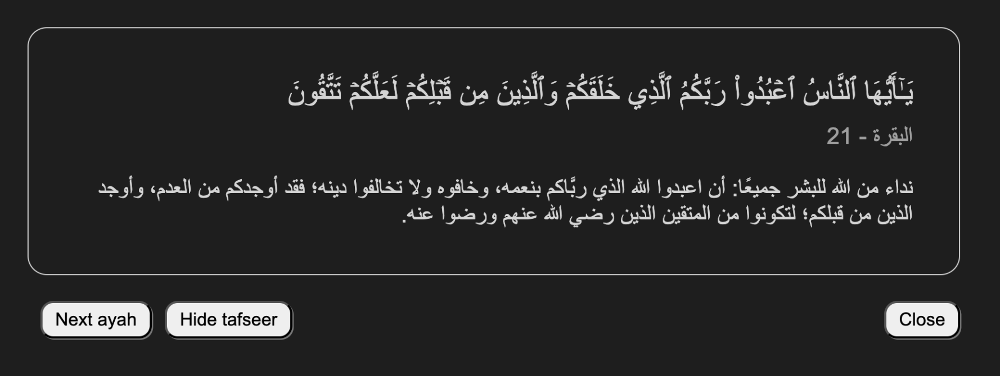

# AyaCode - Start Your Coding Session with a Verse of Quran

This extension brings the beauty and wisdom of the Quran directly into your VS Code workspace. Start your coding sessions with a verse of reflection or quickly access the Tafseer for deeper understanding.

## Features

- **Verse Display:** Displays a new verse each time you open VS Code.
- **Sequential or Random:** Choose between sequential or random verse order.
- **Tafseer Integration:** Easily toggle the display of Tafseer (interpretation) alongside the verse.
- **Customizable Settings:** Configure the extension to your preferences.

## Requirements

None! Just install and enjoy.

## Extension Settings

- `ayaCode.ayahMode`: `sequential` or `random` (default: `sequential`)
- `ayaCode.showTafseer`: `true` or `false` (default: `true`)

## Known Issues

- None reported yet.

## Future Enhancements

- Add the ability to quickly copy the displayed Ayah or its Tafseer to the clipboard.

## Contributing

Contributions are welcome! Please open an issue or submit a pull request.

Ready to infuse your coding sessions with Quranic inspiration? Install AyaCode now!
